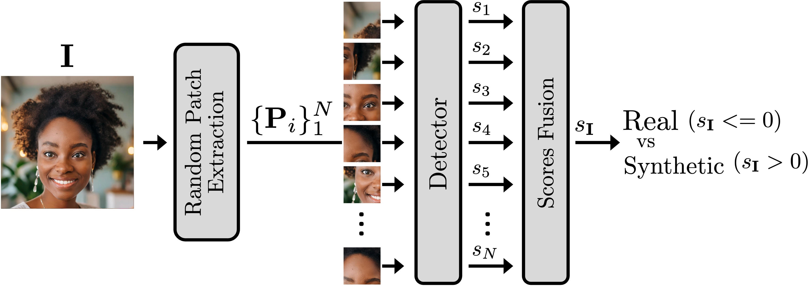
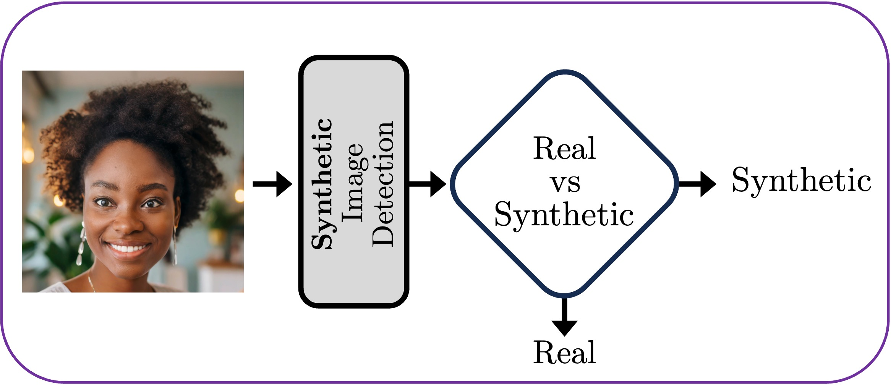
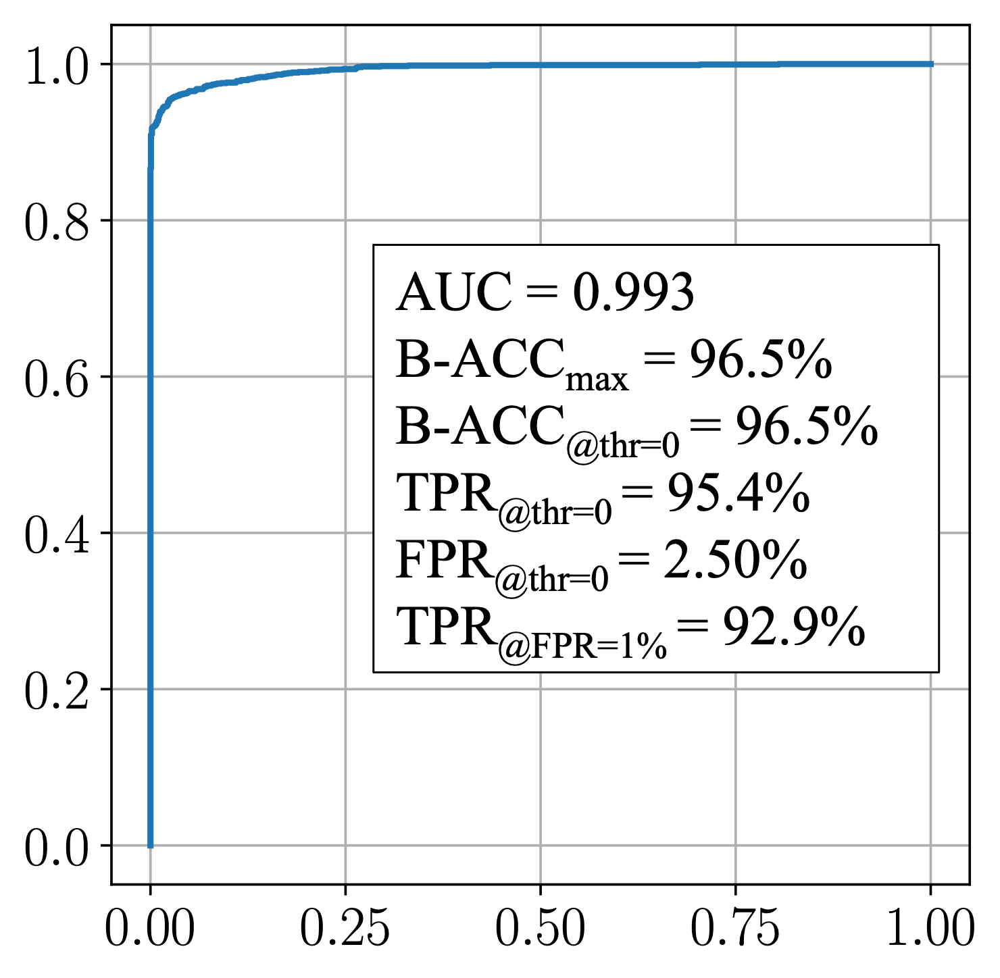
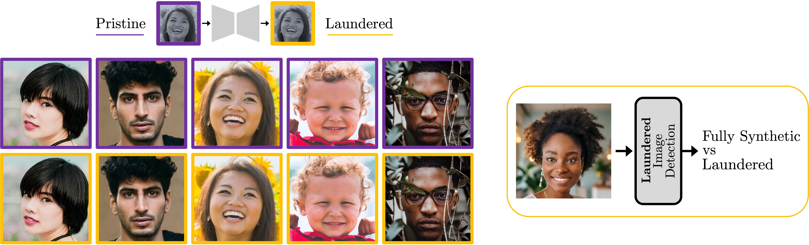

# Synthetic (and SD Laundered) Image Detection

[**When Synthetic Traces Hide Real Content: Analysis of Stable Diffusion Image Laundering**](https://arxiv.org/pdf/2407.10736), accepted to be presented at IEEE WIFS 2024

Sara Mandelli, Paolo Bestagini, Stefano Tubaro<br/>
[Image and Sound Processing Lab - Politecnico di Milano](http://ispl.deib.polimi.it/)


_This repository contains two forensic detectors developed to distinguish real images from synthetic ones and fully synthetic from Stable Diffusion (SD) laundered images.
The complete description of the methodology is available [here](https://arxiv.org/pdf/2203.02246.pdf).
The detector is based on patch extraction in random locations from the image under analysis. Patches' scores are then aggregated to produce the final image score. The network architecture is the EfficientNet-B4._
<p align="center">

</p>

## Prerequisites
Create and activate the conda environment
```bash
conda env create -f environment.yml
conda activate synth_img_det
```
## Synthetic image detector

<p align="center">

</p>

_We define an image to be **real** if its pixel content generally comes from a photograph; it can have undergone post-processing operations like compression, cropping or resizing, but its original content has been acquired by a digital camera sensor. On the contrary, we say that the image is **synthetic** if it is the result of a synthetic generation model applied to an input signal. See [arXiv](https://arxiv.org/pdf/2407.10736) for more information._

### Model's weights

Download the model's weights from [this link](https://www.dropbox.com/scl/fi/na1nff3ehp4kz98n1vtdj/synth_vs_real.pth?rlkey=3k4336bs5uqasr75jwz3666di&dl=0) and save them into the main project folder:
```bash
wget -O synth_vs_real.pth "https://www.dropbox.com/scl/fi/na1nff3ehp4kz98n1vtdj/synth_vs_real.pth?rlkey=3k4336bs5uqasr75jwz3666di&dl=1"
```

### Test the synthetic vs real detector on a single image

_Obtain the synthetic vs real score for a single image.
If the score is greater than 0, the image is likely synthetic. 
If the score is lower than 0, the image is likely real._

#### Input arguments

1. `--img_path` specifies the path to the test image
2. `--select_face_test` enables to test only the face area. If not provided, the entire image is tested.
3. `--M` specifies the amount of image patches to aggregate for computing the final score. Suggested values are $M \in [200, 600]$.
   - _Low values of M (e.g., M = 200) correspond to less patch scores that are averaged to compute the final image score. This can lead to higher detection AUC but could need some calibration to well separate the scores at threshold = 0._
   - _Larger values of M (e.g., M = 600) lead to a more robust detector that needs less calibration to well separate the scores at threshold = 0, but can result in slightly lower detection AUC._
   - _Examples of this behaviour are shown in [Notebook][#notebook]._

#### Example of test
```bash
python test_real_vs_synthetic_singleimg.py --img_path $PATH_TO_TEST_IMAGE --M 600
```

### Synthetic vs Real Detection In The Wild
We achieve AUC = 0.993 on [AI Forensics Open Research Challenge Evaluations (AI FORCE): Challenge 1, AI-Generated Image Detection](https://semanticforensics.com/ai-force/challenge-1) released by DARPA in May 2024. 
<p align="center">

</p>

## Laundered image detector

<p align="center">

</p>

_We define an image to be synthetic if it is the result of a synthetic generation model applied to an input signal. If the input signal is a random noise or it is an image hidden in noise, we define the generated image to be **fully synthetic**. If the input signal is a real image passed through Stable Diffusion (SD) encoding and decoding with strength = 0, we define the image to be **laundered**. For simplicity, we do not explore the intermediate scenario of image-to-image translation with strength > 0. See [arXiv](https://arxiv.org/pdf/2407.10736) for more information._

### Model's weights

Download the model's weights from [this link](https://www.dropbox.com/scl/fi/bzg6e6bgqmetfbokb2ve5/fully-synth_vs_laundered.pth?rlkey=443zd7j11jqavhgb381fiiknj&st=jqtfvk0u&dl=0) and save them into the main project folder:
```bash
wget -O fully-synth_vs_laundered.pth "https://www.dropbox.com/scl/fi/bzg6e6bgqmetfbokb2ve5/fully-synth_vs_laundered.pth?rlkey=443zd7j11jqavhgb381fiiknj&st=jqtfvk0u&dl=1"
```

### Test the laundered vs fully-synthetic detector on a single image
_Obtain the laundered vs fully-synthetic score for a single image.
If the score is greater than 0, the image is likely laundered. 
If the score is lower than 0, the image is likely fully-synthetic._

**Watch out**: test only images detected as being synthetic by the [synthetic image detector](#synthetic-image-detector)

1. `--img_path` specifies the path to the test image
2. `--select_face_test` enables to test only the face area. If not provided, the entire image is tested.
3. `--M` specifies the amount of image patches to aggregate for computing the final score. Suggested values are $M \in [200, 600]$.
   - _Low values of M (e.g., M = 200) correspond to less patch scores that are averaged to compute the final image score. This can lead to higher detection AUC but could need some calibration to well separate the scores at threshold = 0._
   - _Larger values of M (e.g., M = 600) lead to a more robust detector that needs less calibration to well separate the scores at threshold = 0, but can result in slightly lower detection AUC._
   - _Examples of this behaviour are shown in [Notebook][#notebook]._

#### Example of test
```bash
python test_fullysynth_vs_laundered_singleimg.py --img_path $PATH_TO_TEST_IMAGE --M 600
```

## How to cite

```bibtex
@article{Mandelli2024,
  title={When Synthetic Traces Hide Real Content: Analysis of Stable Diffusion Image Laundering},
  author={Mandelli, Sara and Bestagini, Paolo and Tubaro, Stefano},
  journal={arXiv preprint arXiv:2407.10736},
  year={2024}
}
```

The proposed method is based on considerations presented in our previous papers:

1. _S. Mandelli, N. Bonettini, P. Bestagini, S. Tubaro, [Detecting Gan-Generated Images by Orthogonal Training of Multiple CNNs](https://arxiv.org/pdf/2203.02246.pdf), IEEE International Conference on Image Processing (ICIP), 2022, doi: 10.1109/ICIP46576.2022.9897310._

```bibtex
@INPROCEEDINGS{mandelli2022detecting,
  author={Mandelli, Sara and Bonettini, Nicolò and Bestagini, Paolo and Tubaro, Stefano},
  booktitle={2022 IEEE International Conference on Image Processing (ICIP)}, 
  title={Detecting Gan-Generated Images by Orthogonal Training of Multiple CNNs}, 
  year={2022},
  volume={},
  number={},
  pages={3091-3095},
  doi={10.1109/ICIP46576.2022.9897310}}
```

2. _S. Mandelli, N. Bonettini, P. Bestagini, S. Tubaro, [Training CNNs in Presence of JPEG Compression: Multimedia Forensics vs Computer Vision](https://arxiv.org/pdf/2009.12088.pdf), IEEE International Workshop on Information Forensics and Security (WIFS), 2020, doi: 10.1109/WIFS49906.2020.9360903._

```bibtex
@INPROCEEDINGS{mandelli2020training,
  author={Mandelli, Sara and Bonettini, Nicolò and Bestagini, Paolo and Tubaro, Stefano},
  booktitle={IEEE International Workshop on Information Forensics and Security (WIFS)}, 
  title={Training {CNNs} in Presence of {JPEG} Compression: Multimedia Forensics vs Computer Vision}, 
  year={2020},
  doi={10.1109/WIFS49906.2020.9360903}}
```


